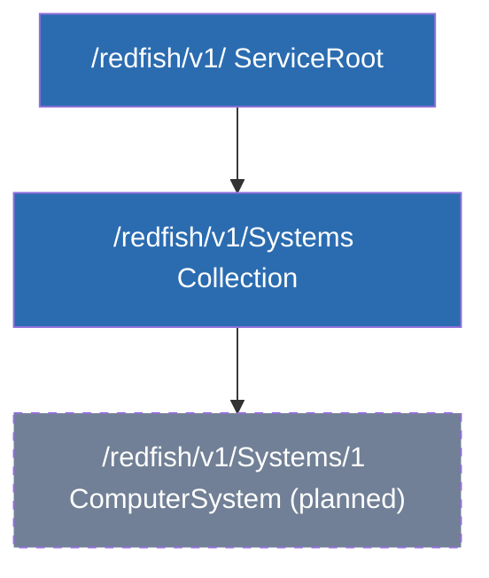
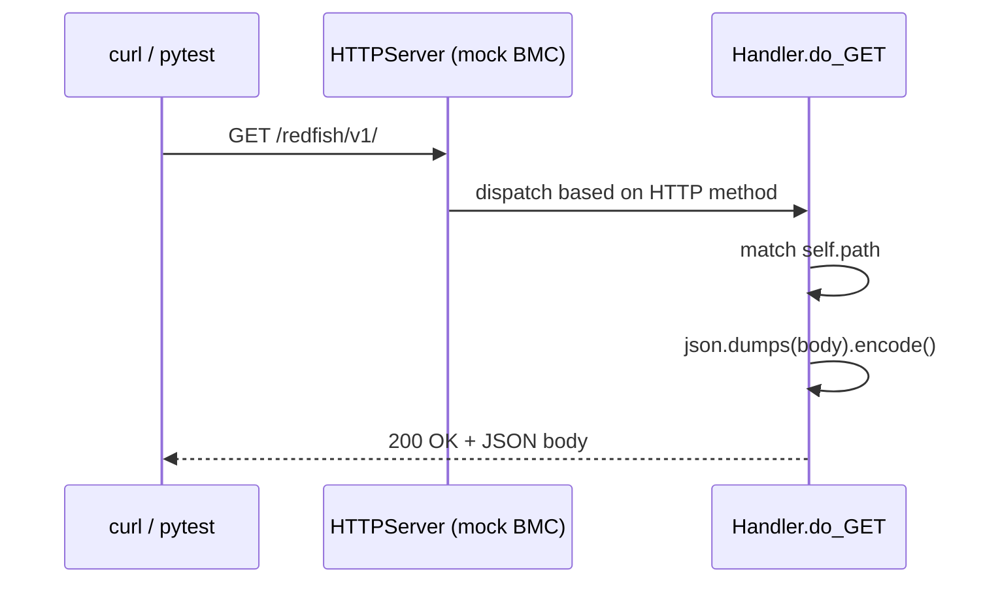

# RedfishQA

A hand-built Python HTTP mock of a Redfish service (DMTF's server hardware
management API), with an automated pytest suite validating it — built from
scratch to close a gap for a Supermicro SDET role that names Redfish, Docker,
Kubernetes, and Python test automation explicitly.

**Mental model:** the server is a hotel. The BMC (Redfish) is the front desk.
A login token is a key card. Each API resource (Systems, Chassis, Managers)
is a room, reachable by following links (`@odata.id`) rather than hardcoded URLs.

## Status: early build, in progress

This is a learning-first build — every line was hand-written and debugged
solo, not scaffolded. Bugs hit and fixed along the way are documented below
because they're as much the point as the working code.

## What exists right now

- `mockserver/redfish_mock.py` — a minimal HTTP server using Python's built-in
  `http.server` (no framework, no dependencies). Currently serves two resources:
  - `GET /redfish/v1/` — ServiceRoot
  - `GET /redfish/v1/Systems/` — a Systems collection with one member link
- `tests/test_service_root.py` — first pytest test, checking ServiceRoot
  returns `200` and the expected `Name` field.

## How to run it

Two terminals required — the server has to be running for tests or curl to
have anything to talk to.

```bash
# terminal 1 — start the mock service, leave it running
source .venv/bin/activate
python3 mockserver/redfish_mock.py

# terminal 2 — manually check it (optional). ALWAYS restart terminal 1 after
# editing redfish_mock.py — Python does not hot-reload.
curl -i http://127.0.0.1:8000/redfish/v1/

# terminal 2 — run the automated test suite (server must still be running)
source .venv/bin/activate
pytest -v
```

## Bugs hit and fixed (kept as a debugging log, not swept away)

1. **Trailing-slash mismatch** — `self.path == "/redfish/v1"` failed against
   an actual request for `/redfish/v1/`. String comparison in Python is exact;
   `curl`/browsers include the trailing slash. Fixed by matching the real path.
2. **`send_headers` vs `send_header`** — typo'd a method name (extra `s`).
   Threw `AttributeError`. Python's error message actually suggested the fix.
3. **Missing `.encode()`** — `wfile.write()` requires bytes; `json.dumps()`
   returns a string. Threw `TypeError: a bytes-like object is required, not 'str'`.
4. **pytest "collected 0 items"** — a test file named `root_test_server.py`
   wasn't discovered because pytest only collects files matching `test_*.py`
   (prefix, not just "contains test"). Renamed to `test_service_root.py`.
5. **Editor buffer vs. disk** — spent a debugging cycle confused why a "fixed"
   assertion kept failing; `cat` on the file proved the edit was never actually
   saved. Lesson: `cat` the file to check ground truth before assuming code is wrong.

## Not built yet (honest TODO — nothing here goes on a resume until it's real)

- [ ] Negative tests (e.g. `GET /redfish/v1/Systems/999` → `404`)
- [ ] Session-based auth (`POST .../SessionService/Sessions` → key-card token,
      protected resource requiring it)
- [ ] Schema/conformance checks, stress test
- [ ] Dockerfile + docker-compose (emulator + test runner containers)
- [ ] Kubernetes Deployment + Job manifests
- [ ] GitHub Actions CI, HTML test reports
- [ ] MySQL results store + PHP dashboard

## Why no framework (FastAPI, etc.)

Deliberate — this is a lightweight, dependency-free mock standing in for a
BMC, not a production API. Built directly on `http.server` to understand the
request/response cycle (status line → headers → blank-line separator → body)
at the level frameworks normally hide.

## Resource tree (what exists so far)



*Solid = built and tested. Dashed = referenced by Systems but not yet a real endpoint.*

## Request flow (a single GET, end to end)


